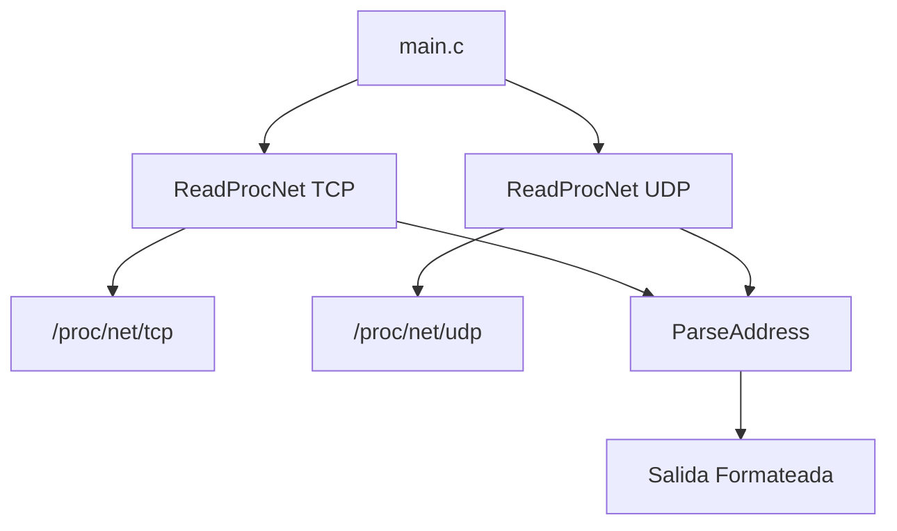

# Monitor de Sockets Abiertos
## Sistemas Operativos - FIE

**Integrantes:**
- Aaron Uriel Guzman Cardoso
- Brandon Hernandez Vargas  
- Claudio Castro Murillo
- María Elena Gabriel Nicolás
- Maria Fernanda Mendez Sanchez

---

## Índice
1. [¿Qué es un Monitor de Sockets?](#qué-es)
2. [Objetivos del Proyecto](#objetivos)
3. [Arquitectura del Sistema](#arquitectura)
4. [Proceso de Desarrollo](#desarrollo)
5. [Hallazgos y Desafíos](#hallazgos)
6. [Conclusiones](#conclusiones)

---

## ¿Qué es un Monitor de Sockets? {#qué-es}
Un **monitor de sockets** es una herramienta que permite analizar las
conexiones actuales que tiene tu computadora, así podemos:
1. Saber qué puertos están abiertos
2. Detectar qué conexiones se han abierto o cerrado
3. Identificar procesos y servicios asociados
4. Facilitar el diagnóstico en problemas de red

Su importancia yace en sus capacidades diagnóstico que nos ayudan a tomar
decisiones, por ejemplo, podemos detectar servicios no autorizados y detectar
sus procesos y usuarios asociados.

---

## Objetivos del Proyecto {#objetivos}

### Objetivo Principal
Crear una **versión simplificada de `netstat`** que demuestre el uso de 
llamadas a la biblioteca estándar de C que internamente utilizan syscalls del kernel Linux.

### Específicamente
- Leer archivos del sistema de archivos virtual `/proc/net/`
- Analizar información de sockets TCP y UDP
- Decodificar la información a un formato legible
- Mostrar estados de conexión TCP
- Utilizar llamadas al sistema básicas (`fopen`, `fgets`, `fclose`, etc)

### Consideraciones
- **Tiempo límite**: 1 semana de desarrollo
- **Enfoque académico**: Priorizar la demostración de conceptos sobre optimización
- **Simplicidad**: Solo demostrar uso básico del sistema operativo, evitando 
  complejidad innecesaria como Sockets Netlink (usados por `ss`)
- **Alcance limitado**: No replicar toda la funcionalidad de `netstat`, 
  únicamente la lectura e interpretación de archivos `/proc/net/`

---

## Arquitectura del Sistema {#arquitectura}

### Enfoque Seleccionado: Lectura de `/proc/net/`



---

## Proceso de Desarrollo {#desarrollo}

### Etapa 1: Investigación (todos)
- Análisis del código fuente de `netstat` y `ss`
- Estudio del formato de `/proc/net/tcp` y `/proc/net/udp`
- Definición de lo que hará el programa

### Etapa 2: Implementación Base (Claudio)
- Lectura de los archivos e impresión básica incluyendo estados TCP.
    - Lectura con `fopen()` y `fgets()`.
    - Lectura con formato usando `sscanf()`
    - Impresión con formato usando `printf()`
- Definición inicial de las funciones
- Revisión de errores vistos.

### Etapa 3: Correcciones pequeñas (Aaron y Elena)
- Conversión de direcciones hexadecimales little-endian
- Uso de regexes en `sscanf()` y `strtoul()` para mayor evitar errores de parsing al leer 
  hexadecimales.

### Etapa 4: Documentación refinada y presentación (Aaron, Claudio y Fernanda)
- Se documentan todas las funciones usadas con sintaxis de Doxygen
- Se realiza un reporte de todo el desarrollo
- Se integra una presentación en base al reporte.

---

## Hallazgos y Desafíos {#hallazgos}

### Problema Principal: Parsing de Puertos Hexadecimales

#### El Problema
```c
/* Una entrada típica: */
"0: 0100007F:0277 00000000:0000 0A ..."
//           ^^^^ El puerto es el 631 (0x0277)

/* Donde ocurre el problema*/
int result = sscanf(line, "%*d: %8X:%hX %8X:%hX %2X", ...);
/*                                  ^^^     ^^^
 * sscanf() por algún motivo devolvía 0 usando %X, y 512 con %hX, %4hX/ o %04hX
 * cuando el resultado real era 631.
 */
```

#### Solución Final
```c
char local_port_hex[5];
sscanf(line, "%*d: %8[0-9A-Fa-f]:%4[0-9A-Fa-f] ...", 
       local_addr_hex, local_port_hex, ...);
local_port = (uint16_t)strtoul(local_port_hex, NULL, 16);
```
- Curiosamente `netstat` también evita el uso de `%X` y recurre a
  expresiones regulares.

### Aprendizajes Técnicos

#### 1. Conversión de little-endian a big-endian para presentación
- Los datos en `/proc/net/tcp` están almacenados en formato little-endian, típico de la mayoría de las computadoras actuales
- Al leer "0100007F", nuestro código extrae correctamente: `1.0.0.127`
- Esta es la representación little-endian donde el byte menos significativo se halla más a la izquierda.
- **Proceso**: Extraemos cada byte usando máscaras de bits y los organizamos en el orden de lectura estándar de IPs

#### 2. Estados TCP en Hexadecimal
| Hex | Estado | Descripción |
|-----|--------|-------------|
| `01` | ESTABLISHED | Conexión activa |
| `0A` | LISTEN | Esperando conexiones |
| `06` | TIME_WAIT | Cerrando conexión |

#### 3. Llamadas al Sistema Utilizadas
```c
FILE *f = fopen(path, "r");     // open() syscall internamente
char *result = fgets(line, 512, f);  // read() syscall internamente  
fclose(f);                      // close() syscall internamente
```

### Herramientas Utilizadas
- **Git/GitHub**: Control de versiones
- **GCC**: Compilación y debugging  
- **VS Code**: Desarrollo colaborativo

---

## Conclusiones {#conclusiones}
- El kernel expone mucha de su funcionalidad no solo a través de funciones
  sino de los mismos archivos disponibles en el sistema de archivos.
- Aunque no usemos llamadas directamente del sistema, si hacemos llamadas
  indirectas a través de funciones estandarizadas como `fopen()`

---


### Referencias
- **Repositorio**: [github.com/Aaron-Uriel-Guzman-Cardoso/simple-socket-monitor](https://github.com/Aaron-Uriel-Guzman-Cardoso/simple-socket-monitor)
- **Documentación completa**: Ver `README.md`, `Notas.md`, y el mismo código
